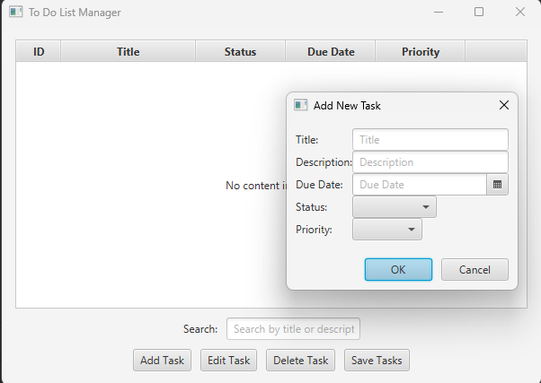
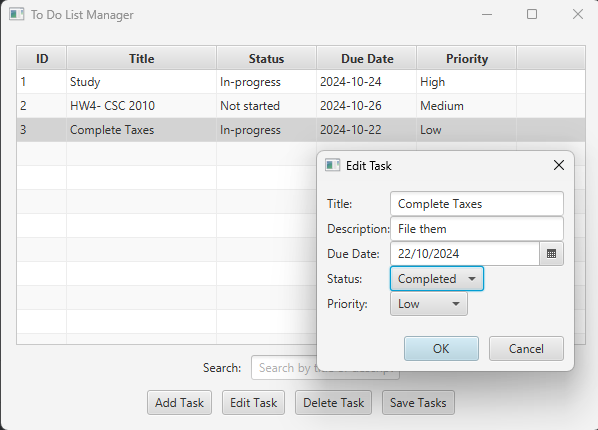

# 📝 To-Do List Manager

Welcome to the **To-Do List Manager**! This open-source and locally-run JavaFX application is a fully functional task management tool that allows users to organize, edit, and persist their to-do items. Whether you're looking to keep track of daily tasks or plan a long-term project, this tool provides a simple and effective way to stay organized.

## 📖 Project Overview

The **To-Do List Manager** is built with Java and JavaFX, providing a user-friendly graphical interface for managing tasks. Key features include:

- **User Authentication**:
   - Log in or create an account to manage tasks securely.
   - Each user has their own task manager and file (`tasks_<username>.txt`) for storing tasks.

- **Task Management**:
   - **Add Tasks**: Add tasks with details like title, description, due date, status, priority, and recurrence.
   - **Edit Tasks**: Modify task details, including updating status, priority, or recurrence.
   - **Delete Tasks**: Remove tasks that are no longer needed.
   - **Search Tasks**: Search tasks by title or description.
   - **Sorting**: Sort tasks by priority, recurrence, and other attributes.

- **Persistent Storage**:
   - Each user’s tasks are saved in a separate file, ensuring user-specific data isolation.
   - Tasks are automatically loaded for the logged-in user.

- **Logout Functionality**:
   - Securely log out and switch between accounts.

This project is perfect for those interested in a secure, multi-user task management solution.

## 🎨 Screenshots

### Overview

<table>
  <tr>
    <td></td>
    <td></td>
  </tr>
  <tr>
    <td align="center">Task Manager Base Screen</td>
    <td align="center">Login Screen</td>
  </tr>
</table>

### Task Management

<table>
  <tr>
    <td></td>
    <td></td>
  </tr>
  <tr>
    <td align="center">Add Task</td>
    <td align="center">Edit Task</td>
  </tr>
</table>

### User Management

<table>
  <tr>
    <td></td>
    <td></td>
  </tr>
  <tr>
    <td align="center">User-Specific Tasks</td>
    <td align="center">Logout</td>
  </tr>
</table>

## 💻 How to Use

### Requirements
- **Java JDK 17 or later**: Ensure you have Java installed on your machine.
- **JavaFX**: The project includes dependencies for JavaFX 17.0.6.

### Setup Instructions
1. **Clone the Repository**:
   ```bash
   https://github.com/IslamiTP/To-Do-List-Manager-Java.git
   cd todolistmanagerjava

2. **Build the Project**:
   - If using IntelliJ IDEA:
      1. Open IntelliJ and select **File > Open...**, then navigate to the `todolistmanagerjava` directory.
      2. IntelliJ should automatically detect and import the Maven project.
      3. Wait for the project to load, ensuring all dependencies resolve correctly.
   - For command-line builds:
     ```bash
     mvn clean install
     ```
   - If you’re using Gradle, replace the Maven command with:
     ```bash
     gradle build
     ```

3. **Run the Application**:
   - In IntelliJ, run the `ToDoListManagerApp` class directly.
   - Alternatively, from the command line:
     ```bash
     java --module-path /path/to/javafx-sdk/lib --add-modules javafx.controls,javafx.fxml -jar target/todolistmanagerjava.jar
     ```

### Using the To-Do List Manager

1. **Login or Create an Account**:
   - Enter a username and password to log in.
   - To create an account, enter new credentials and click the "Create Account" button.

2. **Adding a Task**:
   - Click the **Add Task** button.
   - Fill in the task details such as Title, Description, Due Date, Status, Priority, and Recurrence.
   - Press **OK** to add the task to the list.

3. **Editing a Task**:
   - Select a task from the list.
   - Click the **Edit Task** button to modify task details.
   - Make the changes and press **OK** to save the updates.

4. **Deleting a Task**:
   - Select the task you want to delete from the list.
   - Click the **Delete Task** button.

5. **Saving Tasks**:
   - Click the **Save Task** button to save all tasks to the logged-in user's file.

6. **Loading Tasks**:
   - Tasks are automatically loaded from the user’s specific file when logged in.

7. **Logout**:
   - Click the **Logout** button to return to the login screen.

## 🚀 Features

- **User-Specific Task Management**: Each user’s tasks are stored in a separate file and loaded automatically.
- **Persistent Storage**: Saves tasks for future reference, even after logout or application restart.
- **Advanced Sorting and Searching**: Organize tasks by priority, recurrence, and other attributes, or search by keywords.
- **Intuitive UI**: Built with JavaFX, the UI is clean, user-friendly, and responsive.

## 🛠️ Technologies Used

- **Java**: Core language for building the application logic.
- **JavaFX**: Used for creating a graphical user interface.
- **FXML**: For defining the UI layout.
- **Maven**: For dependency management and building the project.
