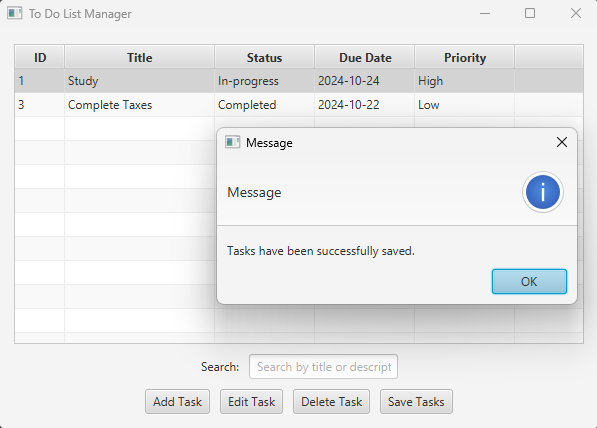

# 📝 To-Do List Manager

Welcome to the **To-Do List Manager**! This open-source  and locally ran JavaFX application is a fully 
functional task management tool that allows users to organize, edit, and persist their to-do items. 
Whether you're looking to keep track of daily tasks or plan a long-term project, this tool provides
a simple and effective way to stay organized.

## 📖 Project Overview

The **To-Do List Manager** is built with Java and JavaFX, providing a user-friendly graphical interface 
for managing tasks. Key features include:

- **Add Tasks**: Add tasks with details like title, description, due date, status, and priority.
- **Edit Tasks**: Modify task details, including updating status or priority.
- **Delete Tasks**: Remove tasks that are no longer needed.
- **Save and Load**: Persist tasks to a local file (`tasks.txt`) to maintain a record even after restarting the application.

This project is perfect for those interested in a simple yet powerful way to manage tasks directly from their desktop.

## 🎨 Screenshots

## Overview

<table>
  <tr>
    <td></td>
    <td></td>
  </tr>
  <tr>
    <td align="center">Base Screen</td>
    <td align="center">Add Task</td>
  </tr>
</table>

### Editing and Saving Tasks

<table>
  <tr>
    <td></td>
    <td></td>
  </tr>
  <tr>
    <td align="center">Edit Task</td>
    <td align="center">Save Task</td>
  </tr>
</table>


## 💻 How to Use

### Requirements
- **Java JDK 17 or later**: Ensure you have Java installed on your machine.
- **JavaFX**: The project includes dependencies for JavaFX 17.0.6.

### Setup Instructions
1. **Clone the Repository**:
   ```bash
   https://github.com/IslamiTP/To-Do-List-Manager-Java.git
   cd todolistmanagerjava
   ```

2. **Build the Project**:
    - If using IntelliJ IDEA:
        1. Open IntelliJ and select **File > Open...**, then navigate to the `todolistmanagerjava` directory.
        2. IntelliJ should automatically detect and import the Maven project.
        3. Wait for the project to load, ensuring all dependencies resolve correctly.
    - For command-line builds:
      ```bash
      mvn clean install
      ```
    - If you’re using Gradle, replace the Maven command with:
      ```bash
      gradle build
      ```

3. **Run the Application**:
    - In IntelliJ, run the `ToDoListManagerApp` class directly.
    - Alternatively, from the command line:
      ```bash
      java --module-path /path/to/javafx-sdk/lib --add-modules javafx.controls,javafx.fxml -jar target/todolistmanagerjava.jar
      ```

### Using the To-Do List Manager

1. **Adding a Task**:
    - Click the **Add Task** button.
    - Fill in the task details such as Title, Description, Due Date, Status, and Priority.
    - Press **OK** to add the task to the list.

2. **Editing a Task**:
    - Select a task from the list.
    - Click the **Edit Task** button to modify task details.
    - Make the changes and press **OK** to save the updates.

3. **Deleting a Task**:
    - Select the task you want to delete from the list.
    - Click the **Delete Task** button.

4. **Saving Tasks**:
    - Click the **Save Task** button to save all tasks to `tasks.txt` for future reference.

5. **Loading Tasks**:
    - Tasks are automatically loaded from `tasks.txt` on startup if the file exists.

## 🚀 Features

- **Persistent Storage**: Saves tasks to a local file (`tasks.txt`) for later retrieval.
- **Intuitive UI**: Built with JavaFX, the UI is clean, user-friendly, and responsive.
- **Status and Priority Options**: Organize tasks by priority and status to help you manage your workload effectively.

## 🛠️ Technologies Used

- **Java**: Core language for building the application logic.
- **JavaFX**: Used for creating a graphical user interface.
- **FXML**: For defining the UI layout.
- **Maven**: For dependency management and building the project.